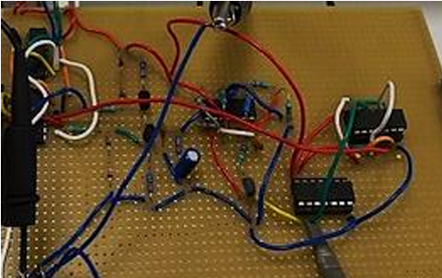

# Integer-N PLL Frequency Synthesizer

Design and experimental implementation of an **integer-N Phase-Locked Loop (PLL) frequency synthesizer**, developed as part of the Electronics laboratory coursework at the National Technical University of Athens (NTUA).

## System Architecture

**Phase/Frequency Detector (PFD) → Charge Pump → Loop Filter → Voltage-Controlled Oscillator (VCO) → Frequency Divider → Feedback**

The PFD detects phase and frequency differences between the reference and feedback signals. The charge pump and loop filter generate the control voltage that drives the VCO, while the frequency divider enables integer-N frequency synthesis.

At lock:

`f_out = M · f_ref`

with **M = 1, 2, 4**.

## Hardware Implementation

The complete PLL was physically implemented for **M = 4** and tested using laboratory equipment. Oscilloscope measurements confirmed the expected frequency multiplication:

`f_out = 4 · f_in`

## Main Circuit Blocks

- Phase/Frequency Detector (PFD)
- Charge Pump
- Loop Filter
- Voltage-Controlled Oscillator (VCO)
- Schmitt Trigger
- Frequency Divider

## Tools & Concepts

Analog & Digital Electronics · PLL · VCO · PFD · Charge Pump · Feedback Control · Frequency Synthesis · Oscilloscope Measurements · Circuit Prototyping

## Laboratory Report

[View the full laboratory report (PDF)](PLL_Lab_Report.pdf)

> The laboratory report is written in Greek.
